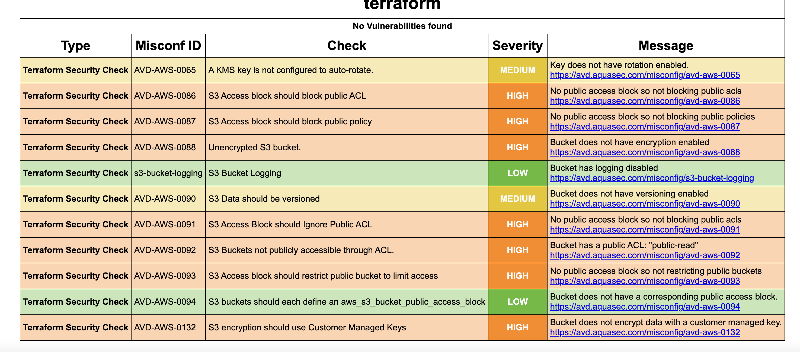

# Cloud Security for DevSecOps Engineers: From Security Models to API Protection

This is the repository for the LinkedIn Learning course `Cloud Security for DevSecOps Engineers: From Security Models to API Protection`. The full course is available from [LinkedIn Learning][lil-course-url].

![course-name-alt-text][lil-thumbnail-url]

This repository will contain the entire codebase and instructions for running Trivy scans within the CodeSpaces container.

## Setup and Configuration

After logging into your environment within GitHub Codespaces, you'll want to ensure that you follow the commands in the sections below.

### 1. Install Trivy in the Workspace Terminal

Once your GitHub Workspace is running, open the terminal in Visual Studio Code and execute the following commands to install [Trivy](https://aquasecurity.github.io/trivy/), a vulnerability and misconfiguration scanner:

```bash
sudo -i
wget https://github.com/aquasecurity/trivy/releases/download/v0.64.1/trivy_0.64.1_Linux-64bit.deb
dpkg -i trivy_0.64.1_Linux-64bit.deb
exit
```

This will download and install version `0.64.1` of Trivy in your workspace.

### 2. Add the HTML Report Template

To output Trivy results in HTML format, download the HTML template provided by the Trivy project:

```bash
$ mkdir -p contrib
$ wget https://raw.githubusercontent.com/aquasecurity/trivy/main/contrib/html.tpl -O contrib/html.tpl
```

## Usage

After installation, you can begin scanning a configuration directory which contains the `main.tf` file by running the following command below:

```bash
trivy config --format template --template @contrib/html.tpl -o results.html 04_06/
```

The results will be written to results.html. You can open the file directly in your browser to review the findings, as shown below:



## Instructor Information

[Damien Burks]

Cloud DevSecOps Engineer & Founder of The DevSec Blueprint

Check out my other courses on [LinkedIn Learning](0)

<!-- README Links -->

[0]: # "Replace these placeholder URLs with actual course URLs"
[lil-course-url]: https://www.linkedin.com/learning/
[lil-thumbnail-url]: https://media.licdn.com/dms/image/v2/D4E0DAQG0eDHsyOSqTA/learning-public-crop_675_1200/B4EZVdqqdwHUAY-/0/1741033220778?e=2147483647&v=beta&t=FxUDo6FA8W8CiFROwqfZKL_mzQhYx9loYLfjN-LNjgA
[Damien Burks]: https://www.linkedin.com/in/damienjburks/
